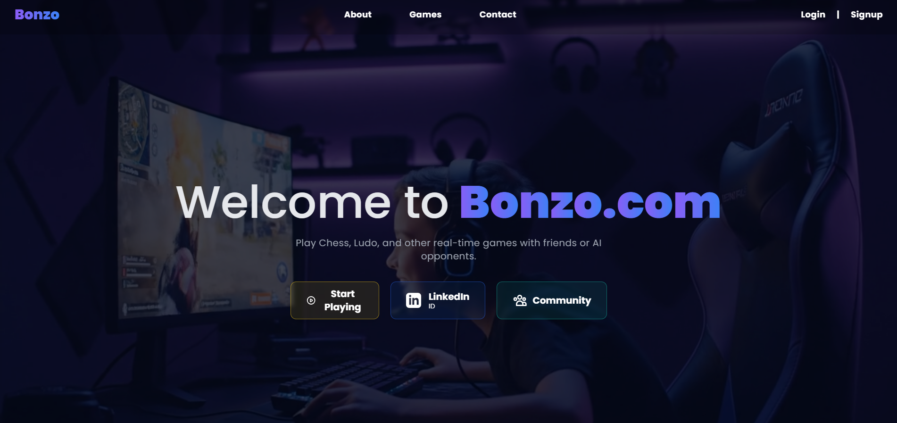

# ♟️ Bonzo Gaming Website

A real-time multiplayer gaming platform featuring live chess, user authentication, and modern animations. Built with Node.js, MongoDB, Socket.IO, and GSAP.


---

### ▶️ [Live Demo (https://bonzo-gaming-website.onrender.com))

---

## 📖 About The Project

Bonzo Gaming is a modern, web-based platform designed for real-time multiplayer strategy games. The flagship game is a fully functional chess application where two players can compete live, with moves synchronized instantly across their browsers. The project leverages a robust backend stack for handling game logic, user data, and secure authentication, while the frontend uses high-performance animation libraries to create a smooth and engaging user experience.



---

## 🌟 Key Features

-   **Real-Time Multiplayer Gameplay**: Challenge friends or other players to a live game of chess with instantaneous move updates.
-   **Secure User Authentication**: A complete authentication system using JSON Web Tokens (JWT) for secure login and session management.
-   **Persistent Data Storage**: User profiles, game states, and history are stored securely in a MongoDB database.
-   **Dynamic UI with GSAP**: High-performance animations and transitions for a fluid user experience, from piece movements to UI interactions.
-   **Server-Side Move Validation**: All moves are validated by `chess.js` on the server to ensure fair play and prevent cheating.
-   **Automatic Role Assignment**: The first two players to join a game are automatically assigned as 'White' and 'Black', with subsequent users joining as spectators.

---

## 🔧 Tech Stack

This project is built with a modern MERN-like stack, chosen for performance, scalability, and real-time capabilities.

| Technology      | Role & Justification                                                                |
| :-------------- | :---------------------------------------------------------------------------------- |
| **Node.js** | The core backend runtime, chosen for its event-driven, non-blocking I/O model.      |
| **Express.js** | A minimal and flexible web framework for Node.js used to build the API and serve pages. |
| **MongoDB** | A NoSQL database used for storing user data, game history, and application state.   |
| **Socket.IO** | Enables real-time, bidirectional communication, which is essential for the live game. |
| **JWT** | Provides a compact and self-contained way for securely transmitting information.      |
| **chess.js** | A powerful JavaScript library for chess logic, handling move generation and validation. |
| **GSAP** | The industry standard for high-performance web animation, used for all UI effects.    |
| **HTML/CSS/JS** | The foundation of the frontend for structure, styling, and client-side logic.       |

---

## 📦 Getting Started

To get a local copy up and running, follow these simple steps.

### Prerequisites

Make sure you have Node.js and npm installed on your machine.
-   **Node.js** (`v14` or higher)
-   **npm** (`v6` or higher)
-   A **MongoDB** instance (local or a free cloud instance from [MongoDB Atlas](https://www.mongodb.com/cloud/atlas))

### Installation & Setup

1.  **Clone the repository:**
    ```bash
    git clone [https://github.com/your-username/bonzo-gaming-website.git](https://github.com/your-username/bonzo-gaming-website.git)
    cd bonzo-gaming-website
    ```
2.  **Install NPM packages:**
    ```bash
    npm install
    ```
3.  **Create an environment file:**
    Create a `.env` file in the root of the project and add the following variables:
    ```env
    MONGO_URI="your_mongodb_connection_string"
    JWT_SECRET="your_super_secret_jwt_key"
    ```

### ▶️ Running the App

Start the development server:

```bash
npm start


The application will be available at http://localhost:3000.

📁 Project Structure
.
├── public/             # Static files (CSS, client-side JS, images)
│   ├── javascripts/
│   └── stylesheets/
├── routes/             # Express route definitions
├── views/              # EJS or HTML templates
├── .env                # Environment variables (not committed)
├── app.js              # Main server entry point
├── package.json
└── README.md
🎯 Future Roadmap
[ ] ⏱️ Add timers for each player to implement Blitz and Rapid modes.

[ ] 🤝 Implement a friend system and private game lobbies.

[ ] 📜 Create a detailed move history log that is viewable during and after games.

[ ] 📱 Enhance mobile responsiveness for a seamless experience on all devices.

[ ] 🎲 Add more real-time games to the platform (e.g., Ludo, Checkers).

📜 License
Distributed under the MIT License. See LICENSE for more information.

📧 Contact
Vikas Gautam - @your_twitter_handle - your.email@example.com

Project Link: https://github.com/your-username/bonzo-gaming-website

Start the development server:

```bash
npm start
